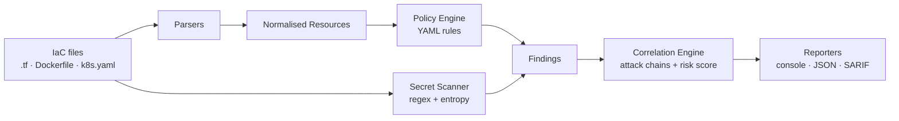

<h1 align="center">🛡️ Warden</h1>

<p align="center">
  <strong>Shift-left security scanner for Infrastructure-as-Code & containers — with attack-chain correlation.</strong>
</p>

<p align="center">
  
  
  
  
  
</p>

---

Warden scans **Terraform**, **Dockerfiles** and **Kubernetes manifests** for
misconfigurations and hardcoded secrets *before they reach production* — and
then does something most scanners don't: it **correlates individual findings
into realistic attack paths** and scores them by real risk.

A public S3 bucket is a finding. *A public bucket that is also unencrypted* is a
data breach waiting to happen — and Warden tells you which one to fix first.

> ⚠️ Warden is an educational / portfolio project built to demonstrate secure
> software design, policy-as-code and DevSecOps tooling. It is not a substitute
> for a mature commercial scanner, but it implements the same core ideas.

## ✨ Why Warden stands out

- **Policy-as-code, as data.** Every check is a small YAML rule — add or tune a
  policy without writing a line of Python. Teams drop their own rules in a folder.
- **Attack-chain correlation (the differentiator).** Warden groups findings that
  *combine* into an exploitable path (container breakout → cloud-admin takeover,
  public + unencrypted data store, secret next to an internet-facing surface…)
  and boosts their score above the sum of the parts.
- **Real risk prioritisation.** Severity-weighted scoring so reviewers look at
  the data-breach primitive before the noisy INFO finding.
- **Native secret detection** with entropy filtering to keep false positives low.
- **CI-ready.** SARIF 2.1.0 output lights up the GitHub *Security* tab, and
  `--fail-on` turns Warden into a pull-request gate.
- **Extensible by design.** New IaC formats are a single parser module; the
  engine, reporters and correlation never change.

## 🎬 Demo

```bash
warden scan ./examples
```

```
╭─────────── Warden 0.1.0 — scan summary ────────────╮
│  CRITICAL: 2  HIGH: 7  MEDIUM: 5  LOW: 1  INFO: 1  │
╰────────────────────────────────────────────────────╯
┏━━━━━━━━━━┳━━━━━━━━━━━━━━━━━━━━━━━━━━━┳━━━━━━━━━━━━━━━━━━━━━━━━━━━━━━┳━━━━━━━━━━━━━━━━━━━━━━━━━━━━━━━━┓
┃ Severity ┃ Rule                      ┃ Resource                    ┃ Location                       ┃
┡━━━━━━━━━━╇━━━━━━━━━━━━━━━━━━━━━━━━━━━╇━━━━━━━━━━━━━━━━━━━━━━━━━━━━━━╇━━━━━━━━━━━━━━━━━━━━━━━━━━━━━━━━┩
│ CRITICAL │ K8S_PRIVILEGED_CONTAINER  │ Privileged container        │ deployment.yaml:1              │
│ CRITICAL │ AWS_IAM_WILDCARD_ACTION   │ Wildcard IAM action         │ main.tf:30                     │
│ HIGH     │ AWS_S3_PUBLIC_ACL         │ Public S3 bucket            │ main.tf:4                      │
│ …        │ …                         │ …                           │ …                              │
└──────────┴───────────────────────────┴─────────────────────────────┴────────────────────────────────┘

Correlated attack chains
╭─────── ⛓ Container breakout to cloud-admin takeover  (risk score 36) ────────╮
│ The stack runs an over-privileged container (root or privileged) AND grants  │
│ wildcard IAM permissions. A single RCE in that container escalates to full   │
│ control of the cloud account. Drop the container privileges and scope IAM.   │
│ Findings: K8S_PRIVILEGED_CONTAINER, AWS_IAM_WILDCARD_ACTION                   │
╰──────────────────────────────────────────────────────────────────────────────╯
```

## 🚀 Install

```bash
git clone https://github.com/your-username/warden
cd warden
pip install -e .
```

Requires Python 3.9+. Runtime dependencies: `python-hcl2`, `pyyaml`, `rich`.

## 🧑‍💻 Usage

```bash
# Human-readable scan
warden scan ./infra

# Only show HIGH and above
warden scan ./infra --min-severity high

# Machine-readable output
warden scan ./infra --format json -o report.json

# SARIF for GitHub code scanning
warden scan ./infra --format sarif -o warden.sarif

# Use it as a CI gate (non-zero exit on HIGH+)
warden scan ./infra --fail-on high

# Bring your own organisation policies
warden scan ./infra --policy-dir ./policies

# List every loaded policy
warden rules
```

## 🏗️ Architecture

Warden is a small, decoupled pipeline. Each stage does one job, so new parsers,
rules and output formats plug in without touching the rest.



| Stage | Module | Responsibility |
|-------|--------|----------------|
| Parse | `warden/parsers/` | Turn raw IaC into normalised `Resource`s |
| Detect secrets | `warden/scanners/secrets.py` | Regex + Shannon-entropy secret detection |
| Evaluate | `warden/engine.py` | Match resources against policy-as-code rules |
| Correlate | `warden/correlation.py` | Combine findings into scored attack chains |
| Report | `warden/report.py` | Console / JSON / SARIF output |

## 📜 Writing a policy (no code needed)

Policies live in `warden/rules/builtin/*.yaml`. Here is a complete rule:

```yaml
- id: AWS_S3_PUBLIC_ACL
  title: S3 bucket is publicly readable/writable
  severity: HIGH
  resource_types: [aws_s3_bucket]
  conditions:
    - path: acl
      operator: in
      value: [public-read, public-read-write]
  message: "The bucket ACL grants public access to the internet."
  remediation: "Set acl = private and use bucket policies for controlled sharing."
  tags: [public-exposure, data-store]   # tags drive attack-chain correlation
```

Supported operators: `equals`, `not_equals`, `in`, `not_in`, `present`,
`absent`, `contains`, `not_contains`, `regex`, `gt`, `lt`, `truthy`, `falsy`.
Dotted paths fan out over lists, so `containers.securityContext.privileged`
means "for any container".

## ⛓️ How attack-chain correlation works

Each finding carries semantic **tags** (`public-exposure`, `encryption-at-rest`,
`privilege`, `excessive-permissions`…). A `ChainTemplate` declares the tag
combination that forms an attack path and a multiplier reflecting that the
combination is more dangerous than the individual issues:

```python
ChainTemplate(
    chain_id="CHAIN_PUBLIC_UNENCRYPTED_STORE",
    title="Internet-exposed, unencrypted data store",
    required_tags=[{"public-exposure", "data-store"},
                   {"encryption-at-rest", "data-store"}],
    multiplier=1.8,
    same_resource=True,   # both issues must land on the same resource
)
```

The score is `Σ severity_weight(findings) × multiplier`, so chains bubble to the
top of the report. Adding a new attack pattern is a few lines of data.

## 🔁 CI/CD integration

`.github/workflows/security-scan.yml` shows Warden running on every pull request,
uploading SARIF to GitHub code scanning, and failing the build on HIGH+ findings:

```yaml
- name: Run Warden (SARIF)
  run: warden scan ./infra --format sarif --output warden.sarif
- uses: github/codeql-action/upload-sarif@v3
  with:
    sarif_file: warden.sarif
- name: Gate the build
  run: warden scan ./infra --fail-on high
```

## 🧪 Development

```bash
pip install -e ".[dev]"
pytest --cov=warden      # 40 tests, 95% coverage
ruff check .
```

## 🗺️ Roadmap

- [ ] CloudFormation and Helm chart parsers
- [ ] Data-flow-aware correlation across modules
- [ ] Baseline / suppression file for accepted risks
- [ ] Mapping of findings to MITRE ATT&CK and CIS benchmarks
- [ ] `pre-commit` hook distribution

## 📄 License

MIT — see [LICENSE](LICENSE).
